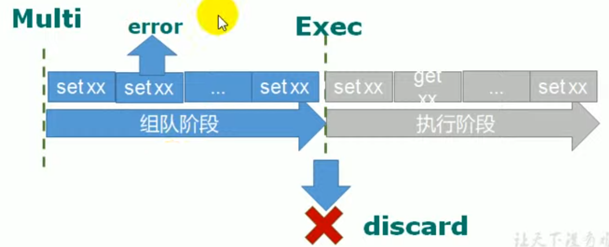
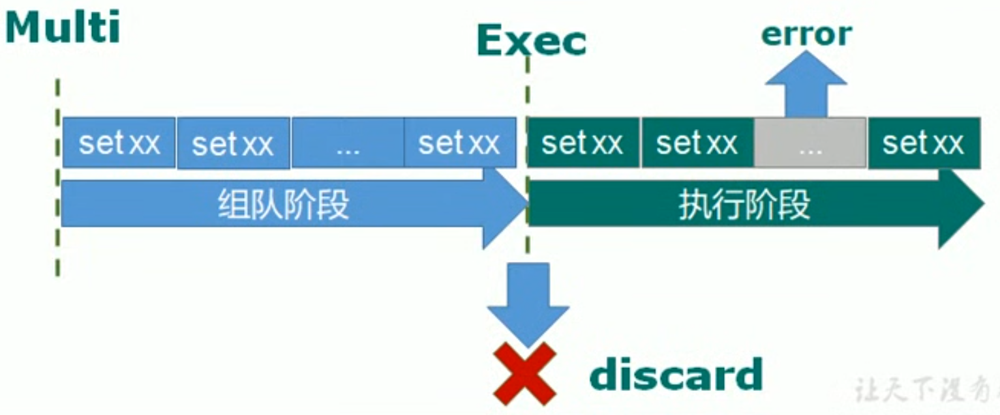
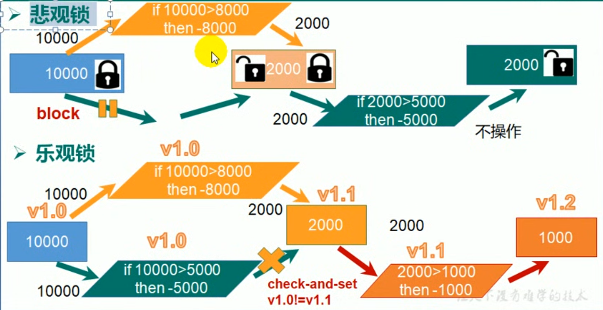

# Transactions

MULTI, EXEC, DISCARD and WATCH are the foundation of transactions in Redis. They allow the execution of a group of commands in a single step, with two important guarantees:

* All the commands in a transaction are serialized and executed sequentially.
* Either all of the commands or none are processed(processed does not mean success) , so a Redis transaction is also atomic. 
* **Errors inside a transaction does not rollback**.

## Related commands
* DISCARD
* EXEC
* MULTI
* UNWATCH
* WATCH

## No roll back

## Redis的事务定义

* Redis的事务是一个单独的隔离操作，事务中所有命令都会序列化，按顺序执行。在执行事务的过程中，不会被其他客户端发送过来的命令请求所打断
* Redis事务的主要作用就是串联多个命令防止插队

## Multi, Exec, Discard
* 从输入Multi命令开始，输入的命令都会依次进入队列中，但不会执行，知道输入Exec后，Redis会依次执行队列中的命令
* 组队的过程中可以通过Discard来放弃组队

## 事务的错误处理
* 组队中某个命令出现了错误，执行时整个队列都会被取消。

* 如果执行阶段某个命令报出错误，则只有报错命令不会被执行，其他命令都会执行，不会回滚。

## Optimistic lock vs Pessimistic lock

* 悲观锁(Pessimistic Lock)， 顾名思义，就是很悲观， 每次去拿数据的时候都会认为别人会修改， 所以每次在拿数据的时候都会上锁， 这样别人想拿这个数据就会block直到它拿到锁。传统的关系型数据库里边就用到了很多这种锁机制， 比如行锁，表锁，读锁，写锁等。都是在做操作之前先上锁。

* 乐观锁(Optimistic Lock)，顾名患义，就是很乐观， 每次去拿数据的时候都认为别人不会修改， 所以不会上锁， 但是在更新的时候会判断一下在此期间别人有没有去更新这个数据，可以使用版本号等机制。乐观锁适用于多读的应用类型，这祥可以提高吞吐量。 Redis就是利用这种Check-and-Set机制实现事务的。
 

## `Watch key1 [key2 ...]`
* 在执行MULTI之前先执行`Watch key1[key2 ...]`可以监视一个(或多个)key, 如果在事务执行之前这个(或这些)key被其他命令改动，那么事务将被中断。

## `Unwatch`
* 取消`Watch`命令对所有key的监视
* 如果在执行`Watch`之后， `Exec`或者`Discard`命令先被执行，那么就不需要再执行`Unwatch`了。